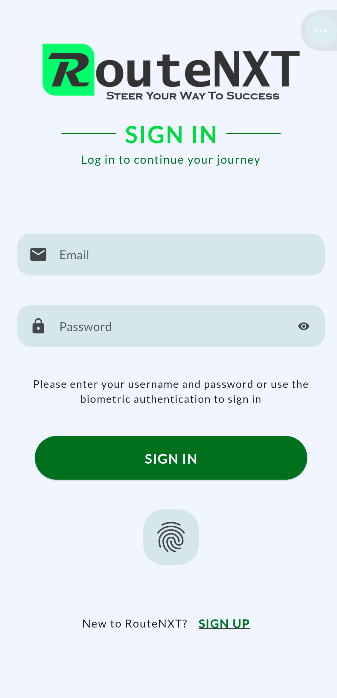
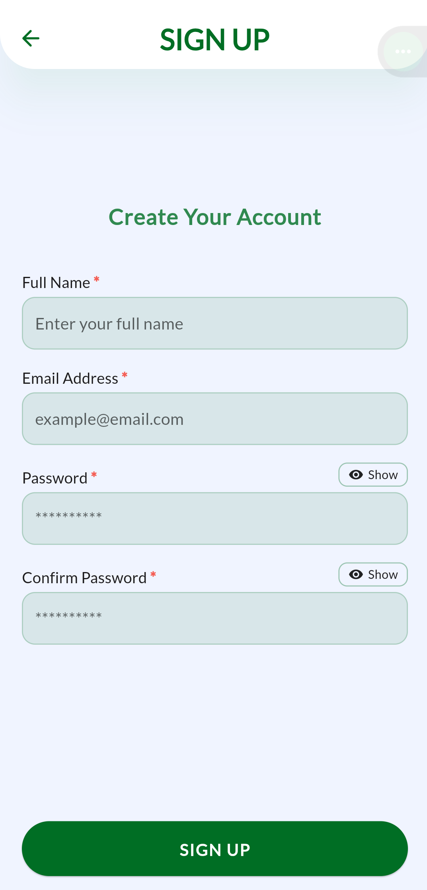
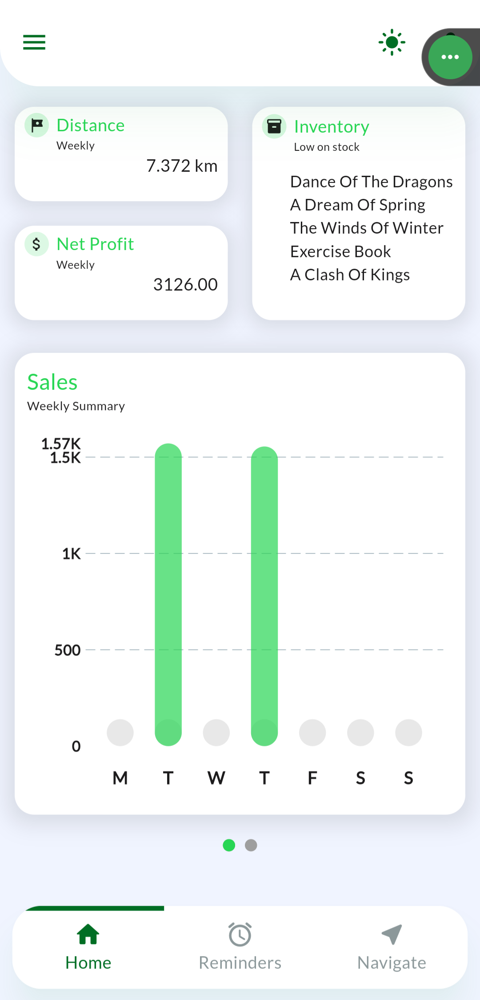
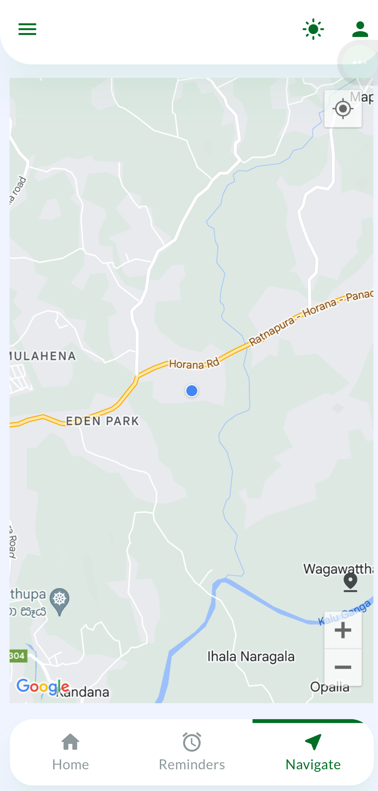
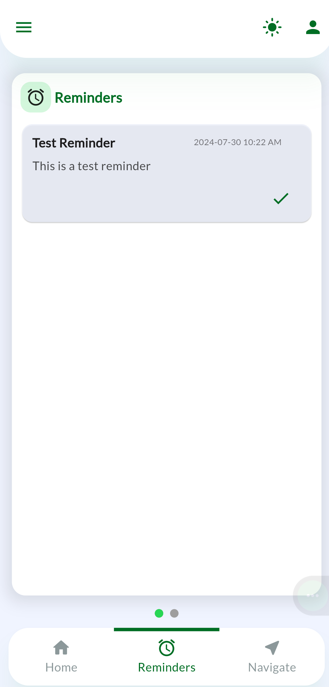
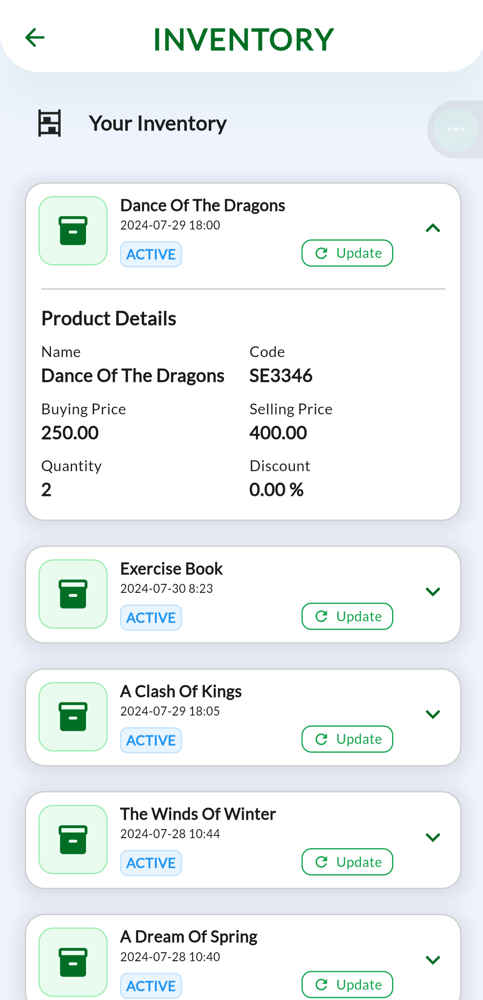
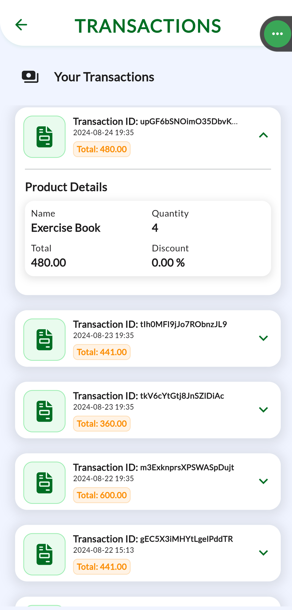
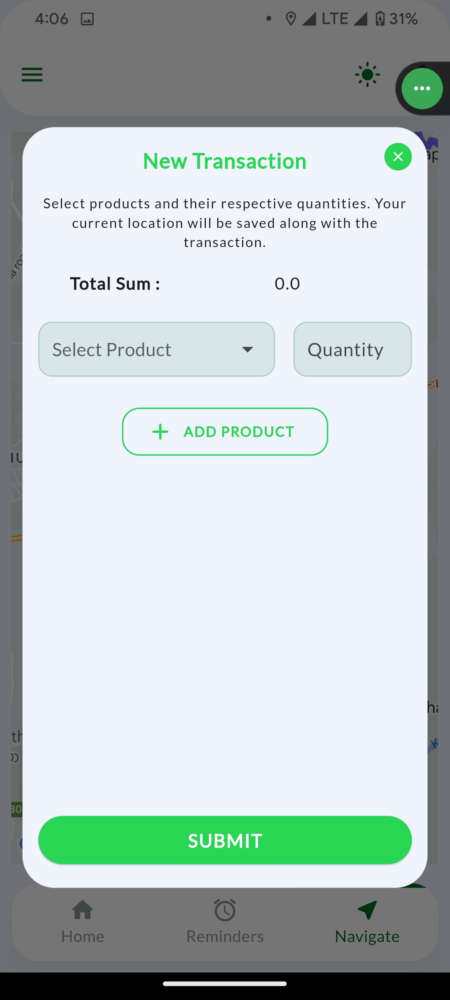

# RouteNXT

Route optimizing mobile application for mobile salespeople

## About

Mobile application that optimizes and suggests routes according to previous profits made in previous sales trips.
So, salespeople can minimize fuel consumption and manage time to maximize profits.
It will also provide range of features including inventory management, view sales history, view profit summary, set
reminders for restocking and view key metrics.

## Here’s a preview:

<table>
  <tr>
    <td></td>
    <td></td>
    <td></td>
  </tr>
  <tr>
    <td></td>
    <td></td>
    <td></td>
  </tr>
  <tr>
    <td></td>
    <td></td>
    <td></td>
  </tr>
</table>

